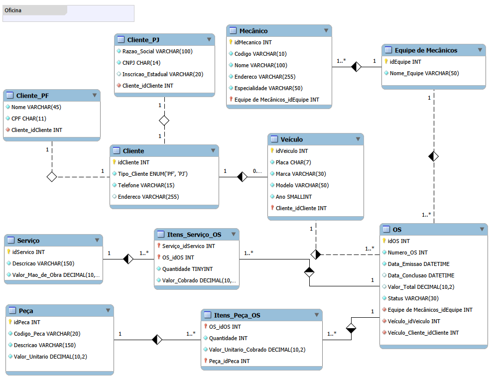

# 🛠️ Oficina Mecânica: Esquema Lógico e Implementação de Banco de Dados

Desafio de projeto focado na transformação de um cenário de negócio em um modelo conceitual, seu posterior mapeamento para o **Esquema Lógico Relacional** e a completa implementação física de um banco de dados para o contexto de uma **Oficina Mecânica**.

---

## 📌 Contexto do Projeto e Regras de Negócio

O objetivo do sistema é gerenciar de forma integrada o fluxo de Ordens de Serviço (OS) de uma oficina. A arquitetura foi desenhada considerando as seguintes premissas:

* **Clientes (Especialização/Herança):** Um cliente centraliza informações comuns de contato (`Cliente`), mas é especializado em Pessoa Física (`Cliente_PF` com CPF) ou Pessoa Jurídica (`Cliente_PJ` com CNPJ).
* **Controle de Veículos:** Cada veículo está associado a um único cliente.
* **Equipes de Trabalho:** Os mecânicos são organizados em equipes independentes. Cada equipe fica responsável por executar os serviços de uma ou mais OSs.
* **Ordem de Serviço (OS):** O documento central do fluxo. Controla o status da manutenção, datas críticas (emissão e conclusão) e calcula o valor total dinamicamente a partir das tabelas associativas.
* **Relações N:M (Tabelas Associativas):** As tabelas `Itens_Servico_OS` e `Itens_Peca_OS` gerenciam respectivamente quais serviços foram prestados e quais peças foram utilizadas em cada OS, garantindo o histórico do valor cobrado na data do evento.

---

## 📐 Modelo Relacional (EER)

O esquema foi projetado no MySQL Workbench e segue a estrutura abaixo:

---

## 📂 Estrutura dos Arquivos no Repositório e como Executar o Projeto

Os scripts foram divididos de forma semântica seguindo boas práticas de desenvolvimento:

1. Execute o script de estrutura (DDL):
   - Localizado em: [`schema_relacional_oficina.sql`](./src/schema_relacional_oficina.sql)
2. Execute o script de população de dados e relatórios (DML/DQL):
   - Localizado em: [`queries_and_data_insertion_oficina.sql`](./src/queries_and_data_insertion_oficina.sql)
---

## 📊 Cenários de Análise Analítica (Queries SQL)

As consultas foram desenvolvidas para simular perguntas reais que a gestão de uma oficina faria ao banco de dados, cobrindo todos os requisitos do desafio:

### 1. Rastreamento de Status por Cliente
* **Pergunta:** Qual o nome dos clientes PF, os modelos de seus carros e o status atual de suas ordens de serviço finalizadas?
* **Tópicos aplicados:** `SELECT`, `INNER JOIN` múltiplos e filtros com `WHERE`.

### 2. Auditoria e Cálculo Financeiro (Atributos Derivados)
* **Pergunta:** Qual o valor total faturado por OS considerando a soma aritmética isolada dos serviços e das peças utilizadas?
* **Tópicos aplicados:** Expressões matemáticas, funções de agregação (`SUM`), tratamento de valores nulos (`IFNULL`), `GROUP BY` e ordenação (`ORDER BY`).

### 3. Desempenho e Produtividade das Equipes
* **Pergunta:** Quais equipes de mecânicos possuem mais de R$ 300,00 acumulados em serviços prestados nas OSs que já foram validadas (Finalizadas ou Aprovadas)?
* **Tópicos aplicados:** Junções, filtros de linhas (`WHERE`), agrupamento e filtros em grupos usando a cláusula `HAVING`.

---

## ✒️ Autor

- **Victor Hugo Nogueira** - [Meu GitHub](https://github.com/victornogueira11)
